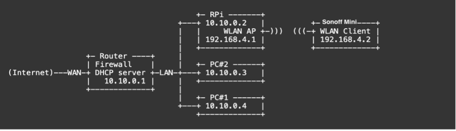

Il progetto si divide in 5 fasi:
1.    Progettazione e sviluppo di un’app Android che, collegata allo stesso Wi-Fi del Sonoff, permette di cambiare lo stato del dispositivo (ON e OFF) e visualizzare lo stato;
2.    Attivazione delle due reti e creazione del gateway:
a.    Creazione di un gateway che accetta in ingresso comandi tramite REST API
b.    Distinzione tra le due reti;
c.    Modifica dell’app Android che invierà i comandi di accensione e spegnimento al gateway invece che al Sonoff Mini;
3.    Design e sviluppo del backend che accetta in input comandi tramite REST API e inoltra le richieste al gateway e modifica dell’app Android per includere un pulsante per richiedere l’accesso ad un’area protetta;
4.    Implementazione delle push notification quando lo stato del dispositivo cambia.
5.    Implementazione di un sistema di autenticazione in App.
Ogni fase ha visto lo sviluppo di un nuovo componente o di una nuova feature.

# Fase 1

In questa fase si è sviluppata un’app Android che fosse in grado di comunicare direttamente con il Sonoff Mini attraverso il protocollo MQTT. Si noti che la prima fase non prevede la creazione del network secondario, ciò implica che, per permettere la comunicazione, l’app e il Sonoff Mini devono necessariamente essere collegati alla stessa rete, altrimenti non sarebbe possibile raggiungere il Sonoff.
Al lancio, l’app deve effettuare una sottoscrizione al topic “stat/tasmota_8231A8/POWER1”, che rimane aperta per tutta la vita dell’applicazione, e una pubblicazione di un messaggio vuoto sul topic “cmnd/tasmota_8231A8/Power1”, in modo da ottenere lo stato del dispositivo e poter settare correttamente l’UI.
Sul primo topic il Sonoff Mini pubblica un messaggio contenente lo stato del dispositivo quando quest’ultimo viene fatto cambiare oppure in risposta ad una pubblicazione sul secondo topic.

Figura 4.1: Diagramma di sequenza della fase 1 (connessione al broker)

Quando un utente cambia lo stato del dispositivo, l’app deve pubblicare un messaggio contenente lo stato (ON o OFF) su cui si vuole portare il Sonoff Mini sul topic “cmnd/tasmota_8231A8/POWER1”

 
Figura 4.2: Diagramma di sequenza della fase 1 (cambio di stato)

# Fase 2

Questa fase si divide in tre punti: 
»    Creazione di un network secondario che non sarà accessibile a nessuno e al quale sarà collegato solo il Sonoff Mini;
»    Creazione di un gateway che accetta in ingresso chiamate REST e le traduce in comandi per il Sonoff;
»    Modifica dell’app che, con l’introduzione del gateway, non comunicherà più direttamente con il Sonoff, ma con il gateway.
La realizzazione del network secondario deve avvenire tramite il Raspberry Pi, il quale, connesso ad una rete LAN, deve essere configurato come wirless access point
 
 
Figura 4.3: Distinzione delle due reti attraverso il Raspberry Pi

Il gateway, sviluppato in Java con il framework Spring, espone tre API:
»    getStatus(), questa API apre la connessione con il broker, si sottoscrive al topic “stat/tasmota_8231A8/POWER1”, pubblica un messaggio vuoto sul topic “cmnd/tasmota_8231A8/Power1” e chiude la connessione dopo aver intercettato il messaggio. Infine, restituisce lo stato del Sonoff;
»    changestatusON(), questa API cambia lo stato del Sonoff in ON, apre la connessione, effettua una pubblicazione sul topic “cmnd/tasmota_8231A8/POWER1” con il messaggio “ON”, chiude la connessione e restituisce una ResponseEntity;
»    changeStatusOFF(), questa API cambia lo stato del Sonoff in OFF, apre la connessione, effettua una pubblicazione sul topic “cmnd/tasmota_8231A8/POWER1” con il messaggio “OFF”, chiude la connessione e restituisce una ResponseEntity.
Tutte le API devono prendere come paramentro l’id del client, in modo da poter gestire le connessioni dei vari client al broker MQTT.
L’app deve essere modificata per poter effettuare chiamate REST. In particolare, al lancio deve effettuare una chiamata all’endpoint della API getStatus(), in modo da ottenere lo stato del dispositivo e poter settare correttamente l’UI. 
 
 
Figura 4.4: Diagramma di sequenza della fase 2 (connessione al broker)

Mentre deve contattare le API changeStatusON() e chaneStatusOFF() quando un utente vuole cambiare lo stato del Sonoff.
 
 
Figura 4.5: Diagramma di sequenza della fase 2 (cambio di stato)

# Fase 3

Per la terza fase deve essere sviluppato il backend che accetta in ingresso chiamate REST e contatta il gateway, sempre tramite chiamate di tipo REST.
Il backend è stato sviluppato usando Java con il framework Spring ed espone tre API:
»    getStatus(), questa API contatta l’API getStatus() esposta dal gateway e infine restituisce lo stato del Sonoff;
 
 
Figura 4.6: Diagramma di sequenza della fase 3 (connessione al broker)

»    changestatusON(), questa API contatta l’API changestatusON() esposta dal gateway e restituisce una ResponseEntity;
»    changestatusOFF(), questa API contatta l’API changestatusOFF() esposta dal gateway e restituisce una ResponseEntity.
 

Figura 4.7: Diagramma di sequenza della fase 3 (cambio di stato)

Inoltre in questa fase l’app deve essere modificata, aggiungendo un pulsante che consenta all’utente di richiedere l’accesso all’area protetta dal Sonoff. Qunado l’utente richiede l’accesso, l’app contatta il backend tramite una chiamata REST, il backend, sempre tramite REST API, contatta il gateway.
 
 
Figura 4.8: Diagramma della fase 3 (richiesta di accesso)
 
# Fase 4

Nella quarta fase è stato implementato il sistema di push notification tramite i servizi Cloud Messaging e Cloud Firestore, offerti dalla piattaforma Firebase di Google.
Al primo avvio dell’app, l'SDK FCM genera un token di registrazione per l'istanza dell'app client. Il token permette di identificare un device su cui è installata l’app e deve essere salvato per far si che sia possibile inviare notifiche a quella specifica istanza dell’app. 
 
 
Figura 4.9: Diagramma di sequenza della fase 4 (primo avvio dell'app)

Il gateway, al lancio, si connette al broker e si sottoscrive al topic “stat/tasmota_8231A8/POWER1” per intercettare i cambiamenti di stato del Sonoff. Quando un messaggio arriva su questo topic, il gateway deve effettuare una query verso il database Cloud Firestore in modo da ottenere i tokens che identificano i dispositivi che hanno installato l’app, costruire il corpo della notifica, il quale contiene lo stato del Sonoff, e inviarla in Multicast ai dispositivi registrati attraverso i tokens. 
L’app Android, alla ricezione della push notification, deve mostrare la notifica all’utente e apportare le dovute modifiche all’UI per mostrare correttamente lo stato attuale del Sonoff Mini. 
 
  
Figura 4.10: Diagramma di sequenza della fase 4 (push notification)

# Fase 5

Nell’ultima fase, è stato implementato un sistema di autenticazione degli utenti attraverso il servizio di Authentication offerto dalla piattaforma Firebase di Google.
All’avvio l’app mostra un’Activity di login. L’utente, dopo essersi autenticato, deve essere reindirizzato all’Activity che permette di inviare comandi al Sonoff e di richiedere l’accesso all’area protetta. 
Non è prevista un Activity che consenta agli utenti di registrarsi autonomamente, piuttosto è stata implementata una dashboard, riservata agli utenti definiti come amministratori, che consente a questi di aggiungere nuovi utenti inserendo la loro email, assegnandoli una password e il ruolo che ricoprono.
 
  
Figura 4.11: Diagramma si sequenza della fase 5 (login e creazione nuovi account)
 

